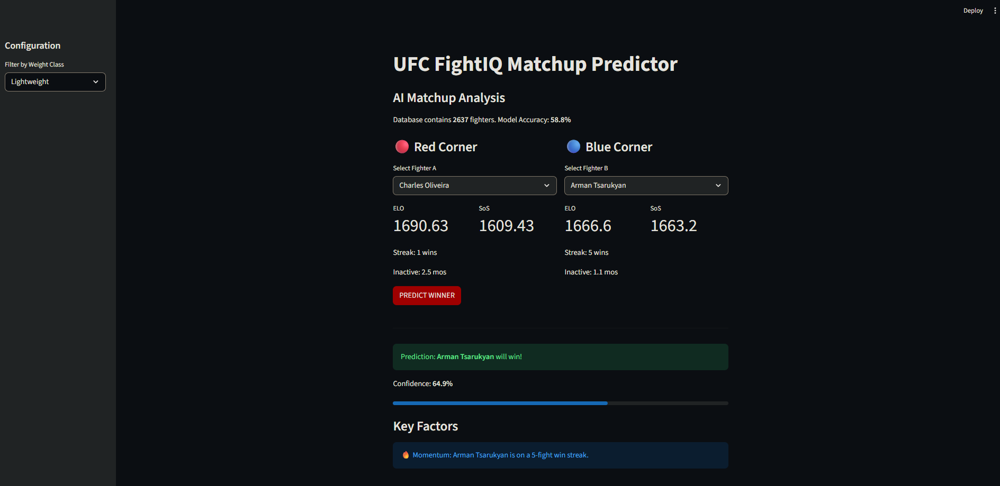

```markdown
# UFC FightIQ: Machine Learning Predictive Engine

### [Live Demo Link Here] | [Portfolio Link]

**FightIQ** is a full-stack data science application that predicts the outcomes of UFC fights using historical data and machine learning. It implements a basic ELO rating engine and uses Random Forest classification to take into account "intangible" factors like ring rust, momentum, and strength of schedule.

 *[Add your screenshot here]*

---

## Features
* **ELO Engine:** Implemented an ELO algorithm that rewards dominant finishes (KO/Sub) and penalizes inactivity ("Ring Rust").
* **Automated Data Pipeline:** uses a scraper (`BeautifulSoup`) that updates the SQLite database with new fight results.
* **Predictive Modeling:** A Random Forest Classifier trained on 5000+ historical bouts, achieving **~59% accuracy**.
* **Interactive Dashboard:** A Streamlit frontend for real-time matchup analysis, visualizing "Tale of the Tape" metrics beyond simple physical stats.

---

## Tech Stack
* **Language:** Python 3.10+
* **Data Processing:** Pandas, NumPy
* **Machine Learning:** scikit-learn (Random Forest, Logistic Regression)
* **Database:** SQLite (Relational Data Modeling)
* **Visualization:** Streamlit, Matplotlib

---

## The "FightIQ" Algorithm
The core of the application is the **Feature Engineering** layer, which takes raw fight logs into predictive signals:

1.  **ELO Scoring:**
    * Not all wins are the same.
    * Standard Win: `K=32`
    * KO/TKO Win: `K=48` (1.5x multiplier for dominance)
    * Fighters who finish fights are statistically more likely to sustain win streaks than decision fighters.

2.  **Inactivity Decay (Ring Rust):**
    * Fighters inactive for >12 months suffer a logarithmic ELO penalty.
    * Case in point, `months_since_last_fight` was the 2nd most critical predictor of loss.

3.  **Momentum:**
    * Quantifies the psychological edge of a win streak (e.g., 5-fight streak vs. coming off a KO loss).

---

## 📊 Performance
The model was backtested on data from 2010–2025.

| Metric | Score | Notes |
| :--- | :--- | :--- |
| **Accuracy** | **58.8%** | Beats the oddmakers baseline (52-55%) |
| **Precision** | **0.58** | Reliable at identifying favorites |
| **Recall** | **0.56** | Conservative on "Upset" picks to minimize risk |

---

## Installation & Usage

1. **Clone the repo**
   ```bash
   git clone [https://github.com/yourusername/ufc-fightiq.git](https://github.com/yourusername/ufc-fightiq.git)
   cd ufc-fightiq

```

2. **Install dependencies**
```bash
pip install -r requirements.txt

```


3. **Run the Scraper (Update Data)**
```bash
python scraper.py

```


4. **Launch the Dashboard**
```bash
streamlit run app.py

```


---

## 🔮 Future Roadmap

* **Integration with Odds API:** Compare model probability vs. Vegas odds to identify "Positive EV" bets automatically.
* **Round-by-Round Analysis:** Utilizing "Strikes per Minute" to predict fight duration (Over/Under).
* **Neural Network Implementation:** Experimenting with PyTorch for deep learning on fighter styles. (Styles make fights)

---

## 👤 Author

**Aditya Singh**

* [LinkedIn](Your LinkedIn URL)
* [GitHub](Your GitHub URL)

```

